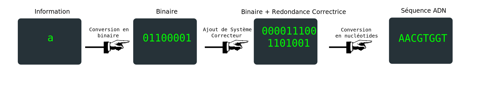
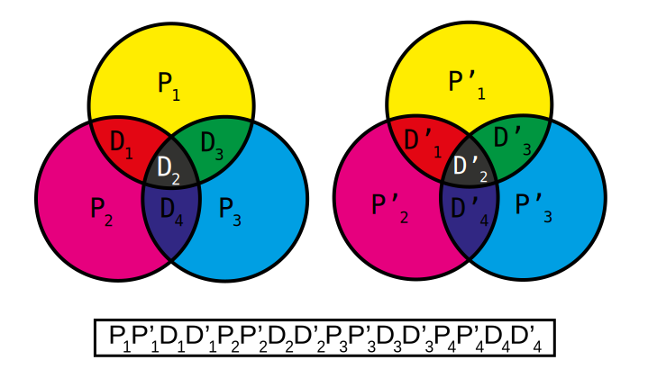
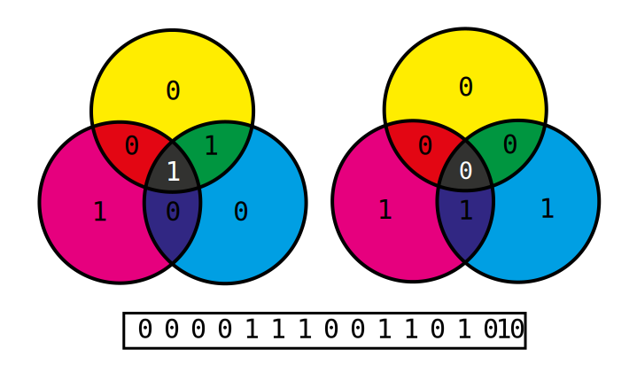

# tpe-adn
A website (in French) made for our year-long 11th grade school project on storing data in DNA, using a nucleotides as our code.
The website was made using the Flask framework to incorporate the programs to convert text to DNA and vice-versa.
The programs made for conversions between text and DNA can be accessed [here](/dna/)​.

Live demo available at: https://tpe-adn.herokuapp.com/

Our program allows you to convert text into DNA nucleotides, while also encoding parity bits, allowing for Hamming Error-Correction.

Here is an overview of the process:

The parity bits are implemented by taking a sequence of 8 bits, then calculating parity bits in groups of 4, as seen below:

This yields the following sequence of bits, for example, if the sequence is an a, `01100001` in binary:

